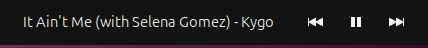
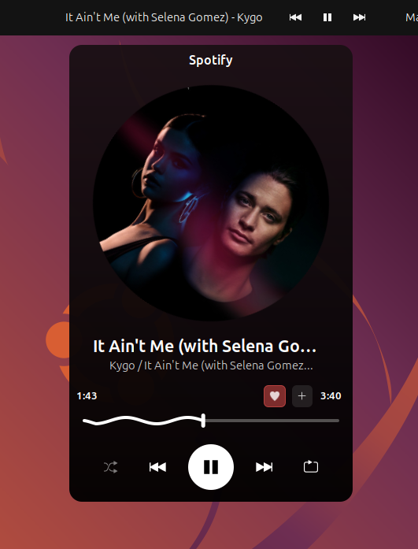
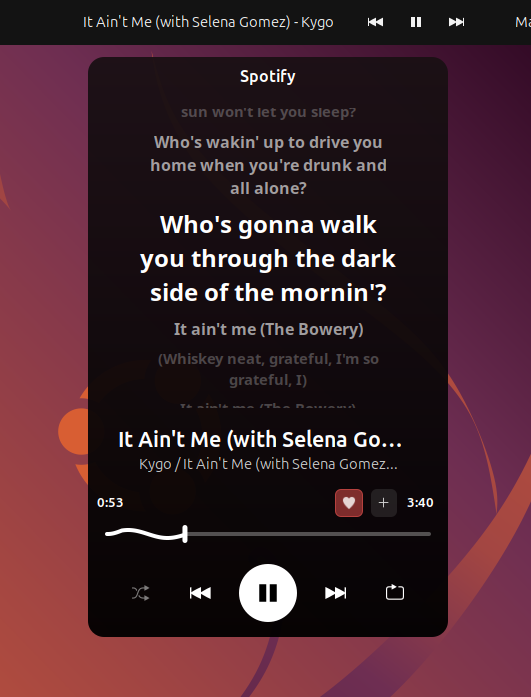

  
  <h1>Spotify Controller</h1>
  
<strong>A powerful and highly customizable Spotify integration for GNOME Shell</strong>

  
Developed by <strong>Narkagni</strong>

<h2>Overview</h2>

  Spotify Controller integrates your music directly into the GNOME Shell top panel. 
  It features a fully customizable UI, a rich popup player with ambient backgrounds, 
  and synchronized lyrics support—all without needing a Premium account.

<h2>Gallery</h2>

  <strong>The Panel & Popup Player:</strong> Clean integration with ambient art.

  
  
  

<h2>Key Features</h2>

  
<strong>Top Panel Media Controls</strong>

  <ul>
    <li>Play/Pause, Next, and Previous buttons directly on the panel.</li>
    <li>Mouse wheel scroll on the panel to adjust volume.</li>
    <li>Flexible positioning (Left, Center, or Right side of the panel).</li>
    <li>Toggle visibility of individual buttons.</li>
  </ul>

  
<strong>Rich Popup Player</strong>

  <ul>
    <li>Album art display with an <strong>ambient background</strong> effect.</li>
    <li>Track title, artist info, and playback controls (Shuffle/Repeat).</li>
    <li>Large, touch-friendly UI.</li>
  </ul>

  
<strong>Animated Progress Slider</strong>

  <ul>
    <li>Choose between <strong>Wavy</strong> or <strong>Straight</strong> slider styles.</li>
    <li>Smooth, real-time animation linked to track progress.</li>
    <li>Click and drag to seek.</li>
    <li>Customize thickness, speed, and colors.</li>
  </ul>

  
<strong>Synchronized Lyrics</strong>

  <ul>
    <li>Automatically fetches synced lyrics for the current track.</li>
    <li>Smooth auto-scrolling view.</li>
    <li>Toggle lyrics view simply by clicking the album art.</li>
  </ul>

  
<strong>Deep Customization</strong>

  <ul>
    <li>Adjust button spacing, margins, and icon sizes.</li>
    <li>Customize fonts, font sizes, and text colors.</li>
    <li>Toggle the vinyl rotation animation for cover art.</li>
  </ul>

<h2>Installation</h2>

<h3>Requirements</h3>
<ul>
  <li>GNOME Shell 45 - 49</li>
  <li>Spotify (App or Web Player)</li>
  <li><code>libglib2.0-bin</code> (Required for schema compilation)</li>
</ul>

<h3>Install from Source</h3>

<strong>1. Clone the repository</strong>

<pre>
git clone https://github.com/NarkAgni/spotify-controller.git
cd spotify-controller
</pre>

<strong>2. Install using Make</strong>

<pre>
make install
</pre>

<strong>3. Restart GNOME Shell</strong>

For X11: Press <code>Alt+F2</code>, type <code>r</code>, and hit Enter. 
For Wayland: Log out and log back in.

<strong>4. Enable the extension</strong>

<pre>
gnome-extensions enable spotify-controller@narkagni
</pre>

<h2>Support Development</h2>

  This extension is free and open-source. If you enjoy using it, consider supporting the development.

  
  &nbsp;&nbsp;
  

 

  
<strong>Crypto Addresses</strong>

   
  
<strong>Bitcoin (BTC):</strong>

  <pre>1GSHkxfhYjk1Qe4AQSHg3aRN2jg2GQWAcV</pre>

  
<strong>Ethereum (ETH):</strong>

  <pre>0xf43c3f83e53495ea06676c0d9d4fc87ce627ffa3</pre>

  
<strong>Tether (USDT - TRC20):</strong>

  <pre>THnqG9nchLgaf1LzGK3CqdmNpRxw59hs82</pre>

  License: GPL-3.0

